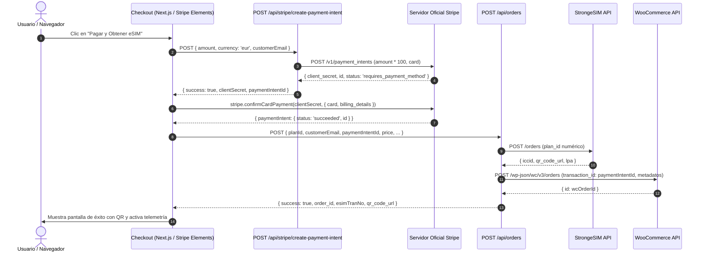

# Guía Técnica de Integración: Stripe PaymentIntents y Flujo de Cobro

Esta documentación describe la arquitectura y el flujo técnico de pago implementado con Stripe en el frontend y backend de ME-SIM (`src/app/checkout/page.js`, `src/app/api/stripe/create-payment-intent/route.js` y `src/app/api/orders/route.js`).

---

## 1. Configuración de Entorno

### Variables de Entorno
```env
# Clave privada del servidor para interactuar con la API de Stripe
STRIPE_SECRET_KEY=sk_live_... (o sk_test_...)

# Clave pública para Stripe Elements en el frontend
NEXT_PUBLIC_STRIPE_PUBLISHABLE_KEY=pk_live_... (o pk_test_...)
```

> **Simulación / Modo Sandbox:** Si `STRIPE_SECRET_KEY` no se encuentra configurada en el entorno, el endpoint `/api/stripe/create-payment-intent` conmuta de forma segura a modo simulación devolviendo un `mockClientSecret` (`pi_mock_...`), permitiendo realizar pruebas de flujo completas sin arrojar errores de ejecución.

---

## 2. Flujo Completo del PaymentIntent

El procesamiento de pagos en ME-SIM sigue el estándar seguro de Stripe (cumplimiento estricto de PCI-DSS, impidiendo que datos crudos de tarjeta toquen nuestro servidor).



---

## 3. Especificación de Endpoints y Payloads

### A. Creación del PaymentIntent (`POST /api/stripe/create-payment-intent`)
Inicia el cobro sin confirmar.

**Petición (JSON):**
```json
{
  "amount": 14.90,
  "currency": "eur",
  "customerEmail": "cliente@ejemplo.com"
}
```

**Llamada saliente hacia Stripe API (`https://api.stripe.com/v1/payment_intents`):**
- Formato: `application/x-www-form-urlencoded`
- Cabecera: `Authorization: Bearer <STRIPE_SECRET_KEY>`
- Parámetros:
  - `amount`: valor en céntimos enteros (ej. `Math.round(amount * 100)` -> `1490`).
  - `currency`: código ISO en minúsculas (ej. `eur`).
  - `payment_method_types[]`: `card`.
  - `receipt_email`: email del cliente.
  - `metadata[integration]`: `"ME-SIM Next.js Headless"`.

**Respuesta Exitosa (`200 OK`):**
```json
{
  "success": true,
  "clientSecret": "pi_3MtwBwLkdIwHu7ix28a3tqPa_secret_YrKJ...",
  "paymentIntentId": "pi_3MtwBwLkdIwHu7ix28a3tqPa",
  "status": "requires_payment_method"
}
```

### B. Confirmación en Frontend (`src/app/checkout/page.js`)
Uso del SDK oficial `@stripe/stripe-js` con `CardElement`:
```javascript
const result = await stripe.confirmCardPayment(stripeData.clientSecret, {
  payment_method: {
    card: elements.getElement(CardElement),
    billing_details: {
      name: `${form.firstName} ${form.lastName}`.trim(),
      email: form.email,
    },
  },
});
```

---

## 4. Metadatos Compartidos e Idempotencia

Para asegurar la reconciliación entre Stripe, la orden directa y los webhooks:
1. **Trazabilidad de la Transacción:**
   - El `paymentIntentId` (`pi_...`) se envía en el payload de `POST /api/orders`.
   - Se guarda en WooCommerce como `transaction_id: paymentIntentId` y en el metadato `{ key: '_stripe_intent_id', value: paymentIntentId }`.
2. **Cerrojo de Idempotencia (`src/lib/idempotency.js`):**
   - La clave deduplicadora primaria es `dedupeKey = paymentIntentId || `${customerEmail}_${planId}``.
   - Si el usuario hace doble clic o reintenta tras un retardo de red, `checkOrderProvisioned(dedupeKey)` devuelve de inmediato la orden existente con su `iccid` y `qr_code_url` sin generar un segundo cobro ni una segunda compra en StrongeSIM.
3. **Casos Gratuitos o Cupones del 100%:**
   - Si el importe total es 0 (`parseFloat(totalAmount) <= 0`), no se invoca a Stripe y se asigna `paymentIntentId = 'free_coupon'`.
